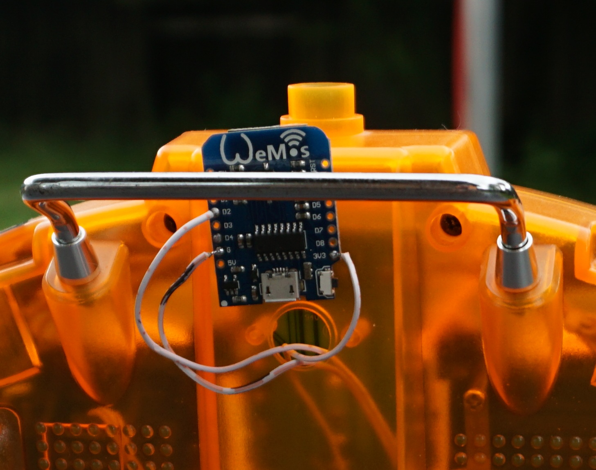

# UDP_RC_TX

Project using the ESP8266 as transmitter UDP RC. Done with arduino for esp8266 ide. It uses PPMSUM imput to transmitter. Transmitter PPM in pin is D4. Easily reconfigurable. 

You go to the transmitter webpage (IP is displayed over serial port). Set your receiver IP and port there. This tells the transmitter to which receiver it is connected, its the "binding".
Be aware the setting is not permanent, hard-code it in firmware.

This does 6 channels at variable rate. Set 100ms for car and 50ms or less for airborne.

Understand the RC does not go from TX to RX, but TX goes to your router and is then redispatched to RX. A good position for your AP is mandatory. You may also use different wired AP's on the same subnet.
Yes, if you set your NAT this works world-wide.

TX settings

BTW to set stuff press first the "senden" button and then the "write to eeprom" button. The "make fake RC" is used for testing.

To extend the range you may use "wired repeater". Those are AP's with in wired repeater mode connected by cat5 wire. The $15 xiaomi C4 i use need to be reset daily or it clogs up, use app "planned restart" feature.
