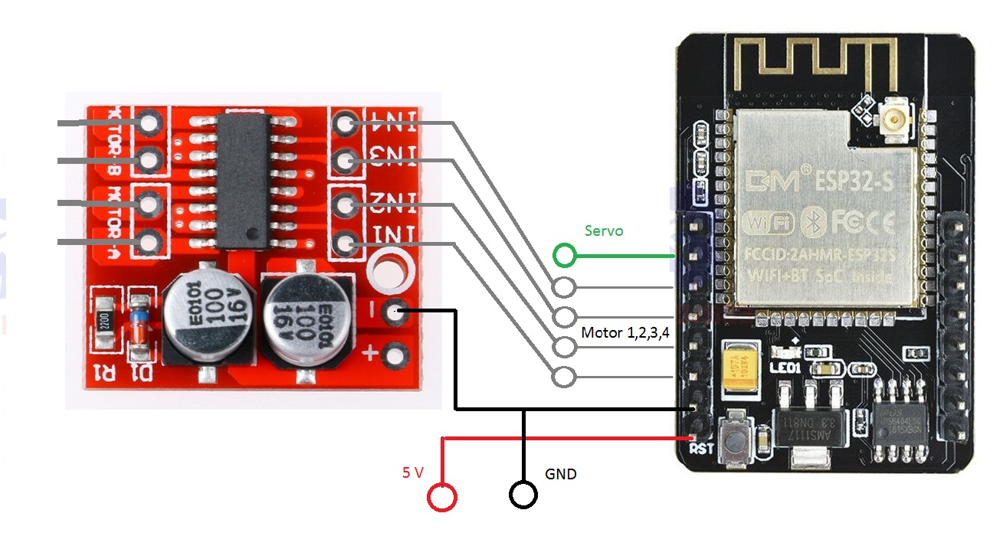
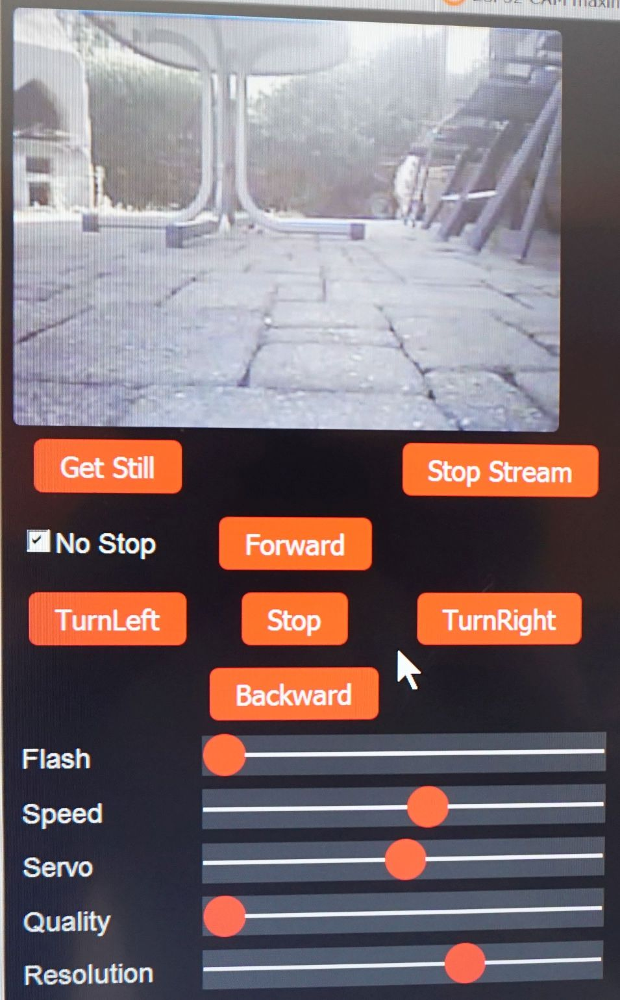
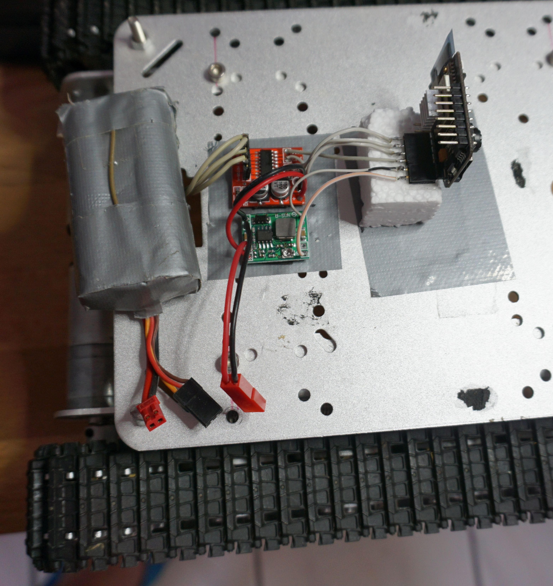
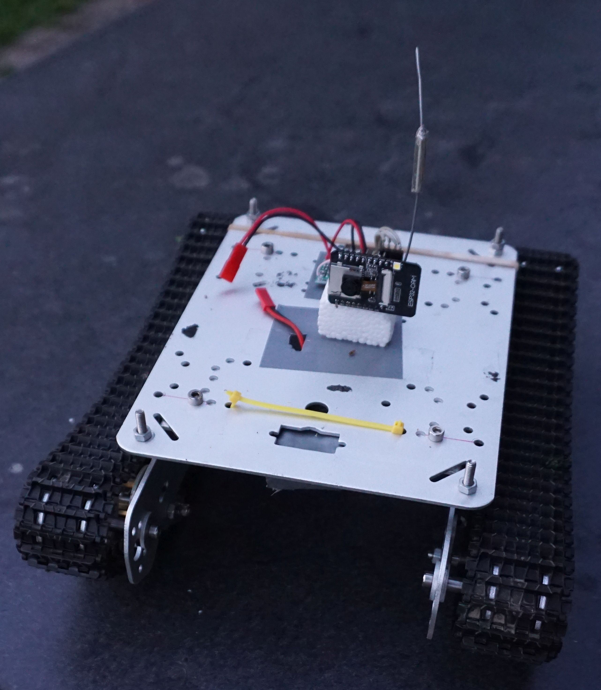
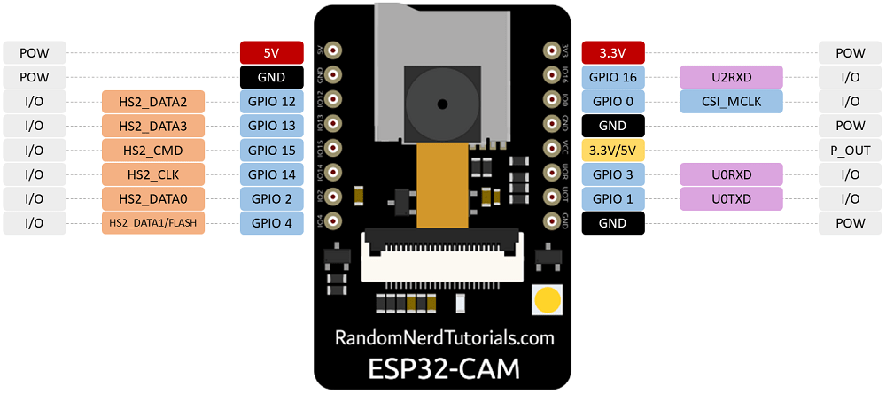
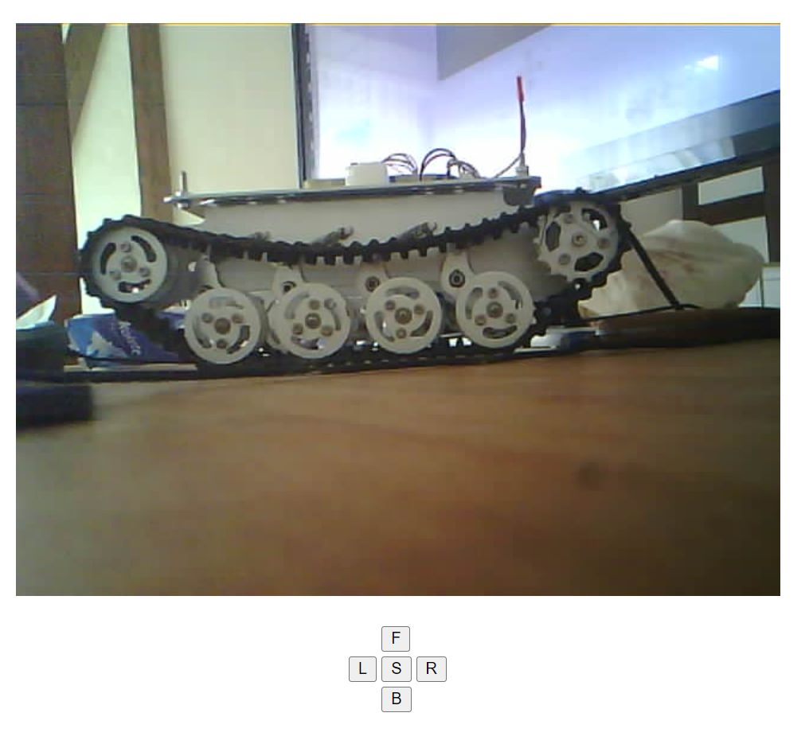

# ESP32-CAM_TANK

Esp32 controlling tracked vehicle while streaming video.
Serial console tells you where to connect. And use your own wifi credentials, not mine.

Wiring:

For the $2 motor dirver search "L298N Motor Driver".

Control:

Build:

ESP-Cam, motor driver, 5V switching regulator.

Extern antenna:

ESP32CAM pinout:

If you experience streaming problems or low wifi range try anther xclk frequency like 16mhz.
Line: config.xclk_freq_hz = 16000000; 

Be aware this motor driver is only good for up to 7.2V. On 12V systems you will have to replace the R and zehner diode making 5V with a small 7805.

Video:
https://youtu.be/qUAGnk382mc

--------------------------------------------------
New simple version "ESP32webCAM_RCTANK" without the bulky script stuff, with auto reconnect and "scan wifi" to allow multiple AP's on different channels with same SSID:

--------------------------------------------------

Version ESP32webCAM_UDP uses UDP to control motors.This need a special UDP transmitter. See esp8266 based espnow_UDP_TX code in the source directory.
Understand the RC does not go from TX to RX, but TX goes to your router and is then redispatched to RX.
This is by far the smoothest control. Uses first aux channel for fwd/rev and second for light on/off.

https://www.youtube.com/shorts/Xo_1b1SBKy8

